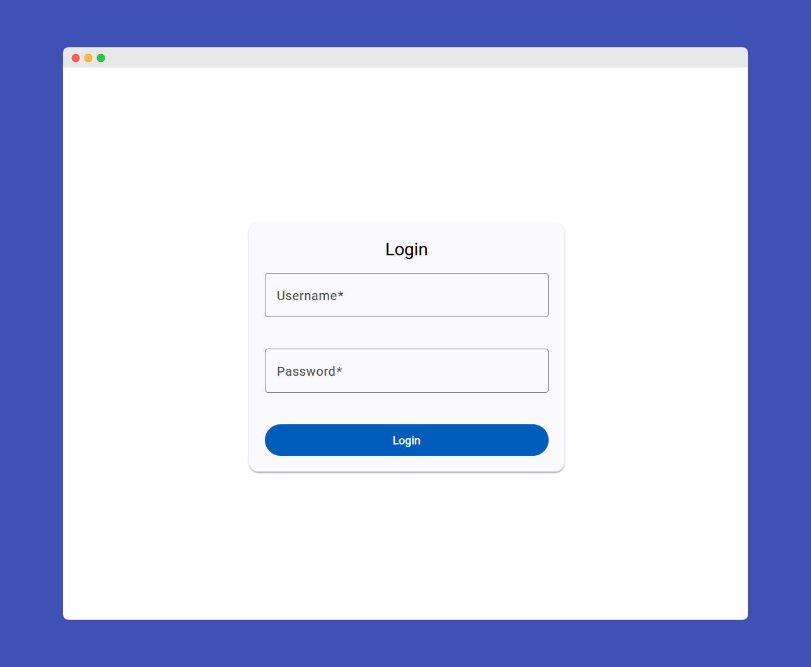
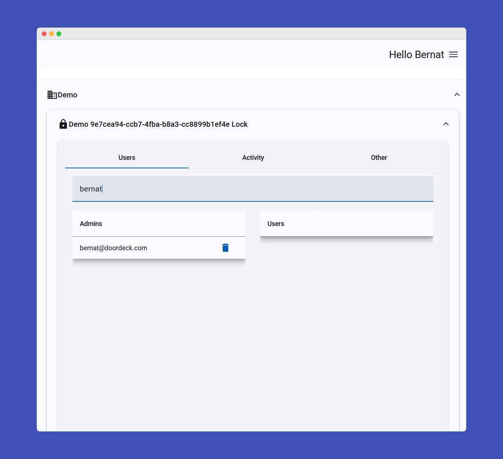
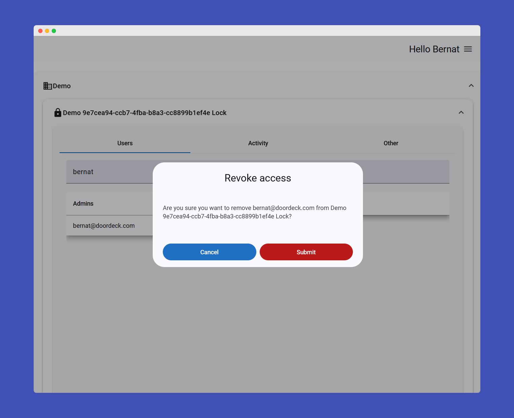
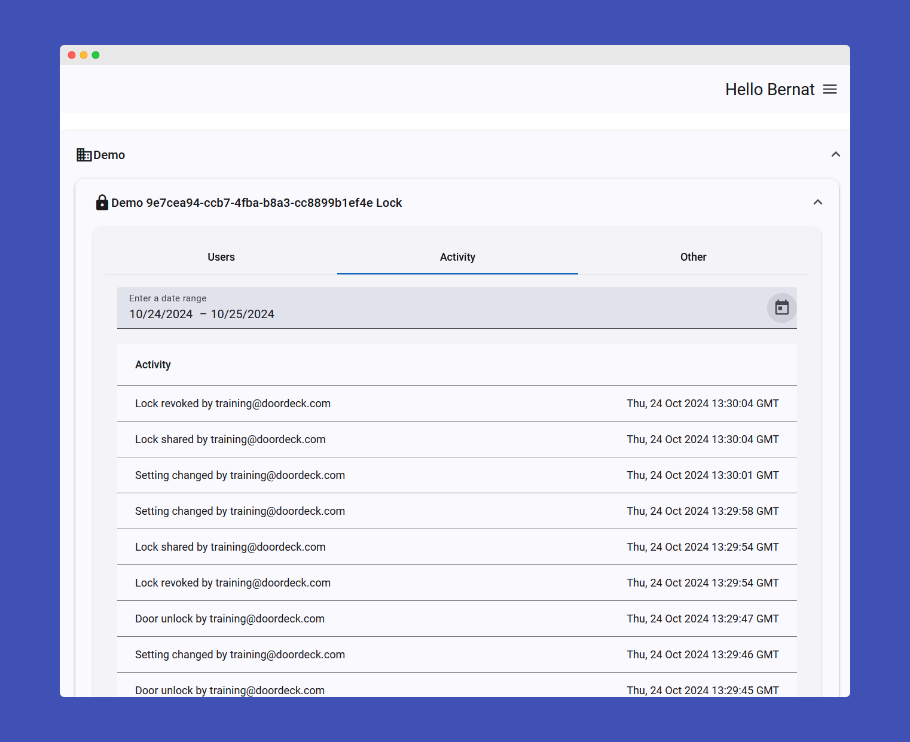
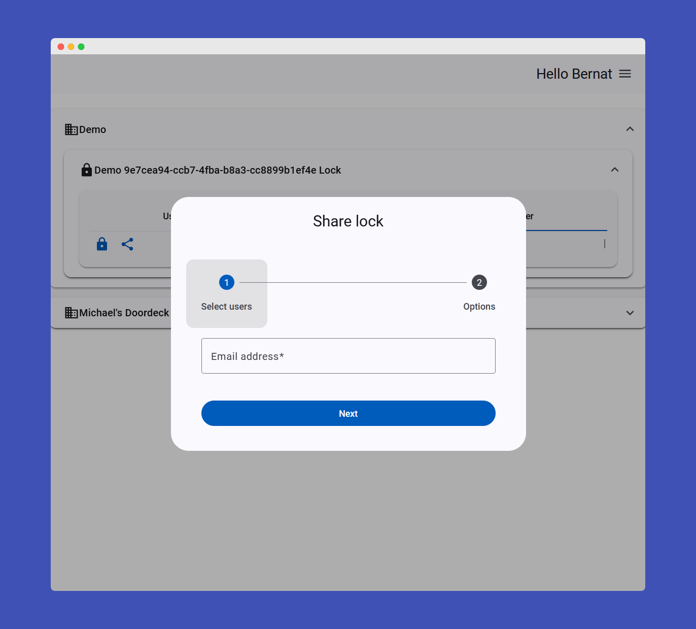
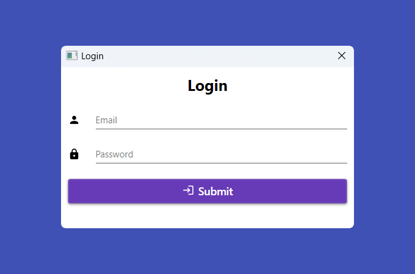
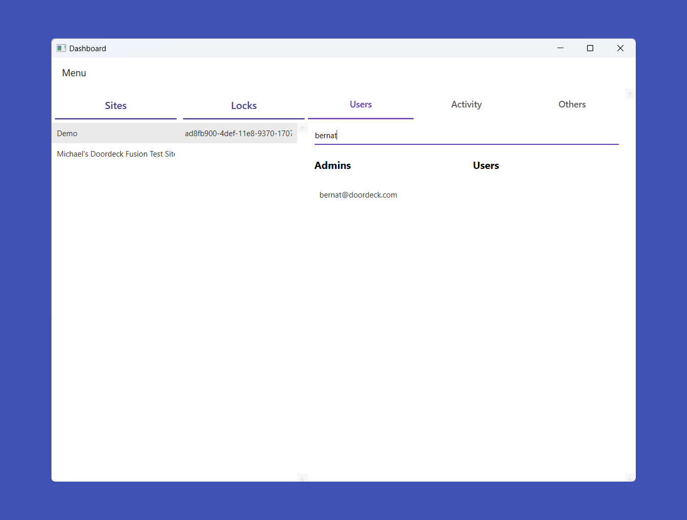
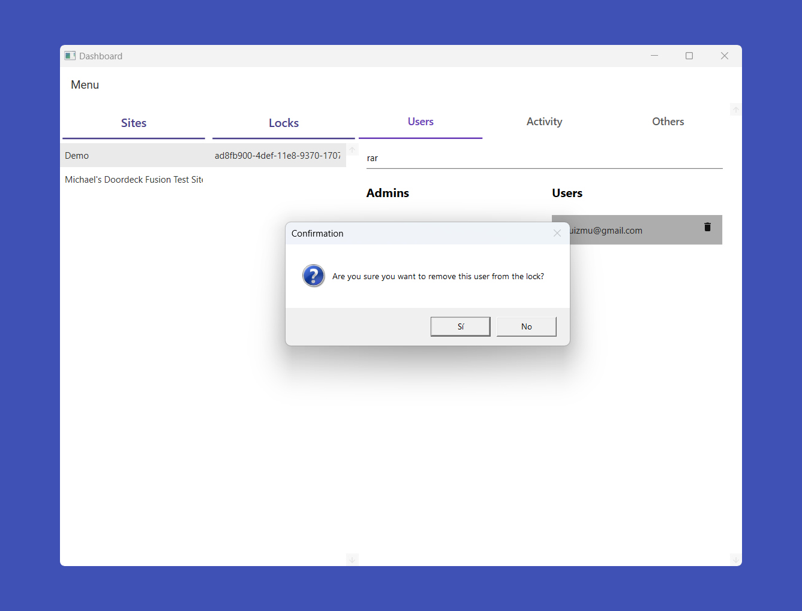
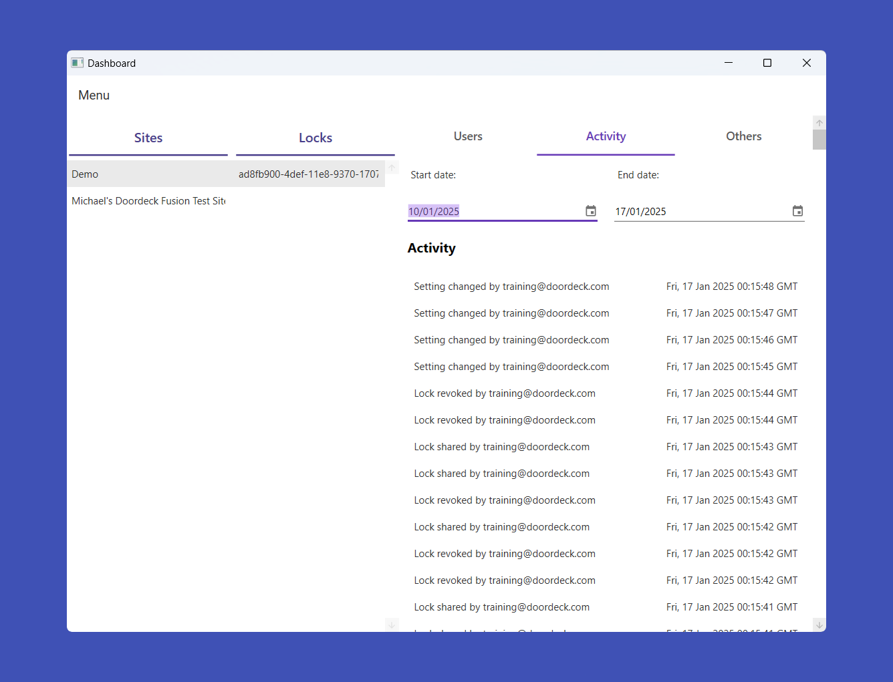
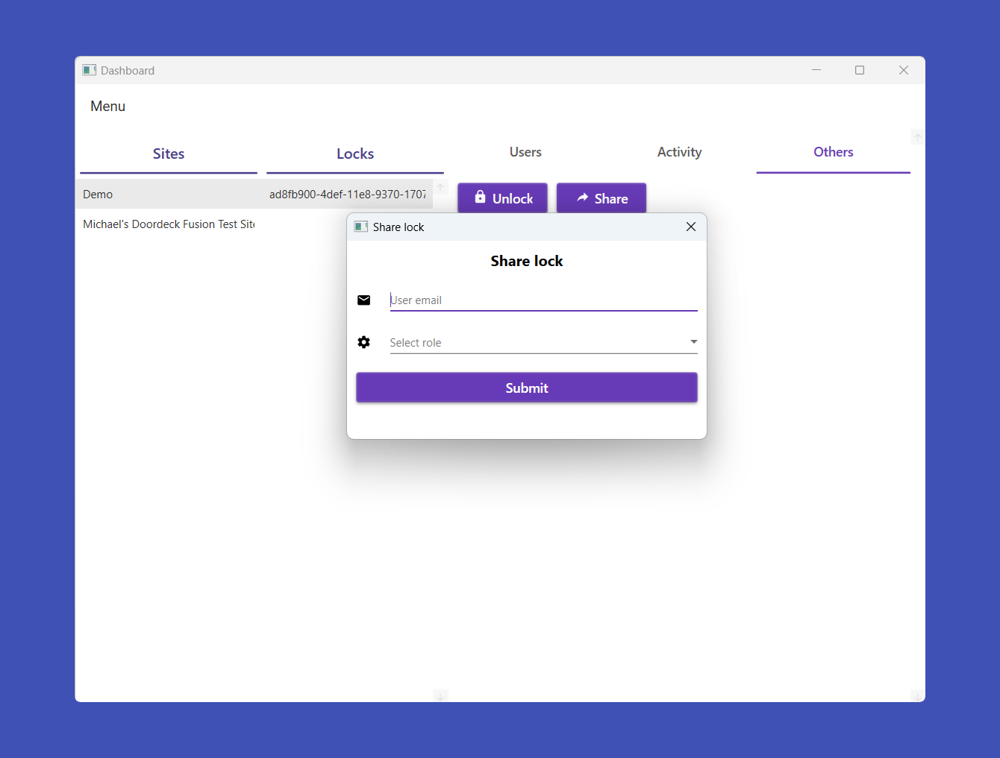

# Samples

Below are the available samples and functionalities for different platforms.

### JVM
<details>
<summary>Show Details</summary>

```kotlin
// TODO
```

</details>

### Android
<details>
<summary>Show Details</summary>

```kotlin
// TODO
```

</details>

### Swift
<details>
<summary>Show Details</summary>

```swift
// TODO
```

</details>

### JavaScript
<details>
<summary>Show Details</summary>

In JavaScript, we provide a sample built with **Angular** demonstrating how the SDK can be integrated into a web application.

#### Functionalities Included:
- User login
- Register ephemeral key with secondary authentication
- List sites
- List locks for a site
- List users for a lock
- List lock activity
- Share a lock
- Revoke access to a lock
- Unlock a lock
- Update user display name
- Update user password
- Logout

#### Sample Screenshots:
| Login Screen | Dashboard | Revoke Access |
|--------------|-----------|---------------|
|  |  |  |

| Activity Log | Share Lock |
|--------------|------------|
|  |  |

</details>

### C#
<details>
<summary>Show Details</summary>

In C#, we provide a sample build with **WPF** demonstrating how the SDK can be integrated into a desktop application.

#### Functionalities Included:
- User login
- Register ephemeral key with secondary authentication
- List sites
- List locks for a site
- List users for a lock
- List lock activity
- Share a lock
- Revoke access to a lock
- Unlock a lock
- Update user display name
- Update user password
- Logout

#### Sample Screenshots:
| Login Screen                              | Dashboard | Revoke Access |
|-------------------------------------------|-----------|---------------|
|  |  |  |

| Activity Log | Share Lock |
|--------------|------------|
|  |  |

</details>

:arrow_left: [Back to index](01_INDEX.md)

### Python
<details>
<summary>Show Details</summary>

```swift
// TODO
```

</details>
